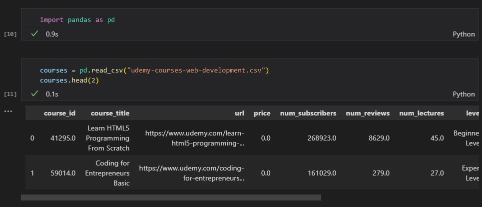

# About this dataset
This dataset contains information about Udemy courses in the Web Development category, including course title, URL, price, number of subscribers, number of reviews, number of lectures, course level, rating, content duration, published timestamp, and subject. With this dataset researchers can track the performance of courses and uncover opportunities to generate revenue. This data set is perfect for those who want to learn more about web development or improve their skills in the field

# Dataset - Column
| Column name|Description|
|-|-|
|course_title|The title of the Udemy course. (String)|
|url|The URL of the Udemy course. (String)|
|price|The price of the Udemy course. (Float)|
|num_subscribers|The number of subscribers for the Udemy course. (Integer)|
|num_reviews|The number of reviews for the Udemy course. (Integer)|
|num_lectures|The number of lectures in the Udemy course. (Integer)|
|level|The level of the Udemy course. (String)|
|Rating|The rating of the Udemy course. (Float)|
|content_duration|The content duration of the Udemy course. (Float)|
|published_timestamp|The timestamp of when the Udemy course was published. (Datetime)|
|subject|The subject of the Udemy course. (String)|

